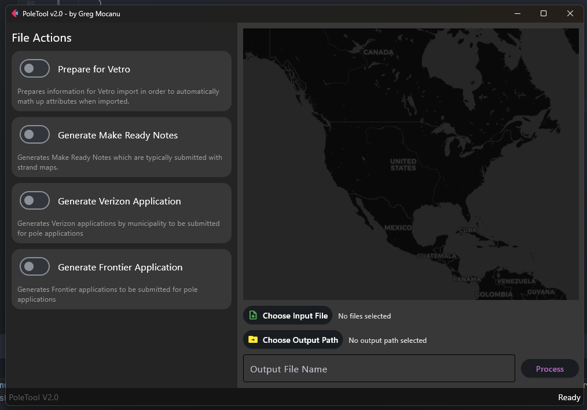

# Loop Internet PoleTool Overview
The Loop Internet PoleTool is an all-in-one program which provides all the tools necessary to parse pole data and prepare/export it in different forms to help make the Design/GIS team's job easier!

## Features *(Latest v2.0)*
- ### Prepare for Vetro
  Refactors and formats pole data to a new Excel sheet such that when it is imported to Vetro there is no need to match up attributes manually. This action also helps with importing data into QGIS.
- ### Generate Make Ready Notes
  Generates a Make Ready Notes Excel sheet which is typically submitted alongside a strand map in Monday.com.
- ### Generate Verizon Application
  Generates Verizon Pole Applications, separated by municipality, which is formatted such that it can be submitted to Verizon right away.
- ### Generate Frontier Application (Work in progress)
  Currently under development. Stay tuned for updates!

## Updates:
- ### New UI
  PoleTool now uses a new UI library built on Google Flutter for a cleaner-look and better application performance.
- ### Pole Preview Map
  In the PoleTool application, there is now a preview map window which displays the locations of all the poles from the inputted xlsx file.

# How To Use
Using the PoleTool is simple and straightforward. Let's dive in!

On the right side of the application is your action checklist. From here you can select one or more file operations you'd like to execute on your input file. On the right side of the application is the file management zone and start button. From here you will be able to input a file, select the ouput for your newly generated file(s), and name the output files.

## Steps:
1. Click the Choose Input File button to select you input Node Attributes sheet.
2. Click the Choose Output button to choose the output location for your new files.
3. Enter in an output file name.
4. Select which operation(s) you would like to perform on the file.
5. Click Process and wait.
6. Done! Check that your files were outputted properly.

### Note: Input file should be node attributes xlsx. Not with ID's or any other file format from katapult. This may cause data to be read improperly.
