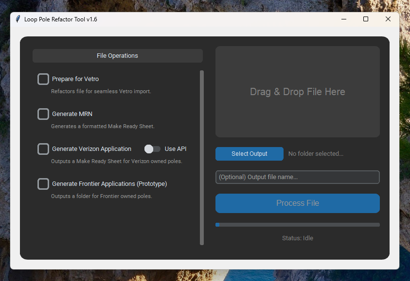

# Loop Internet PoleTool Overview
The Loop Internet PoleTool is an all-in-one program which provides all the tools necessary to parse pole data and prepare/export it in different forms to help make the design team's jobs easier!

## Features *(Latest)*
- ### Prepare for Vetro
  Refactors and formats pole data such that when it is imported to Vetro there is no need to match up attributes manually. 
- ### Generate Make Ready Notes
  Generates a Make Ready Notes excel sheet which is typically submitted alongside a strand map in Monday.com.
- ### Generate Verizon Application
  Generates a Verizon Pole Application excel sheet which is formatted such that it can be submitted to Verizon right away.
- ### Generate Frontier Application (Work in progress)
  Currently under development. Stay tuned for updates!

# How To Use
Using the PoleTool is simple and straightforward. Let's dive in!

On the right side of the application is your actions checklist. From here you can select one or more file operations you'd like to execute on your input file. On the right side of the application is the file management zone and start button. From here you will be able to input a file, select the ouput for your newly generated file(s), and name the output files.
